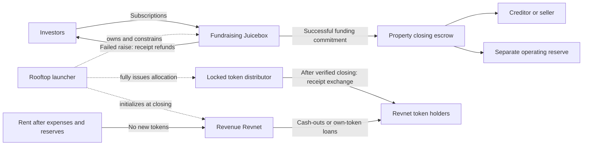

# Rooftop: a Juicebox raise and a revenue Revnet

**Earlier exploration, superseded by [NETWORK_DESIGN.md](NETWORK_DESIGN.md).** The current design uses owner-enacted outcomes, continuing FH-FUND rights and a separate REV distribution. Its gross rent issues tokens to renters and operators. The constrained escrow, receipt exchange and fixed REV supply below are retained design history.

Proposed launcher specification, September 8, 2026. Source-reviewed against the local V6 contracts; not implemented or integration-tested. The existing `src/Rooftop.sol` is the earlier standalone vault, not this launcher. This document extends [the stock Revnet composition](REVNET_COMPOSITION.md).

## One investment, two projects

Rooftop launches a dedicated fundraising Juicebox for each property and financing series. Its standard terminal holds subscription funds. A constrained Rooftop contract owns that project and supplies its escrow rules. At closing, Rooftop initializes a separate stock Revnet that will hold revenue backing and support the existing token-holder loans.

| | Fundraising Juicebox | Revenue Revnet |
| --- | --- | --- |
| Purpose | Hold subscriptions pending a property closing | Hold backing after financing the property |
| Investor instrument | Fixed-price subscription receipts | Property-series Revnet tokens |
| Cash source | Accepted subscriptions and separately recorded sponsor provisions | Net property income, permitted top-ups and realized recovery proceeds |
| Cash exits | Failed-close refunds or a bounded payment to the agreed closing recipient | Stock cash-outs and loans against the borrowing holder's tokens |
| Project owner | A constrained Rooftop instance | Stock `REVOwner` |
| Token issuance | Fixed receipt price while raising | One complete initial allocation; zero ordinary issuance afterward |

The two balances are separate project balances within Juicebox custody. Capital used to pay a creditor or seller is not also counted as the Revnet's redemption cash. Initial revenue backing may be zero.



Use **two project IDs**. The current `REVDeployer` cannot convert an active fundraising project: it calls `JBController.launchRulesetsFor`, which rejects any project with prior rulesets. Its existing-ID path accepts a blank project NFT. See [REVDeployer](../../../revnet-core-v6/src/REVDeployer.sol) and [JBController](../../../nana-core-v6/src/JBController.sol).

The preferred launch flow reserves the blank revenue project ID alongside the fundraising project, so both IDs can appear in the terms before subscriptions open. Rooftop owns the blank ID until its handoff to `REVDeployer`. Reserving an ID does not initialize a Revnet. Two project-creation fees are funded separately in the chain's native asset. Alternatively, create the revenue ID at closing and bind it through the pre-agreed pairing mechanism.

## Fundraising policy

Deploy the fundraiser's standard ERC-20 receipt token before accepting payments. The receipt's current holder owns its refund or conversion right; neither right remains separately attached to the original payer. For example, one settlement-token unit buys one receipt, and one receipt later exchanges for one REV unit. Both project tokens use 18 decimals; the settlement asset may use different decimals.

Use one accepted settlement asset, one terminal and local accounting. Fix the subscription price, funding goal, cap, deadline, closing uses, recipient, attestor and successor Revnet policy before funding. The goal covers the required **net** closing proceeds after fees; the cap is measured in accepted settlement-asset payments.

Recommended fundraiser configuration:

- One zero-duration ruleset, constant issuance weight, zero reserved percentage and no issuance decay.
- No payout limits or payout splits. Payout limits would reserve cash away from the surplus needed for refunds.
- One bounded surplus allowance, callable only through Rooftop's closing method. Its gross budget cannot be renewed by queuing another ruleset.
- Disabled owner minting, custom-token replacement, controller/terminal migration and new accounting contexts. Rooftop exposes no generic call, permission-granting or project-transfer endpoint.
- A pay data hook rejects payments after the deadline, outside `Raising`, in another asset, or above the subscription cap. A zero-forwarded, non-noop after-pay hook authenticates the terminal and records accepted payments and actual issued receipts.
- A cash-out data hook permits fixed-face refunds only in the refund state. A zero-forwarded after-cash-out hook checks the actual net refund and records the burned receipts.
- An immutable approval hook rejects every successor ruleset. A zero duration alone does not freeze a ruleset. The core's omnichain ruleset operator also has a permission override, so omitting an owner reconfiguration method is insufficient by itself.

Rooftop, as the data hook, is itself a privileged minting address in core. Its code must have no alternative mint function. `allowOwnerMinting = false` alone does not constrain every mint path.

The accepted-payment ledger is independent of receipt supply. Holders can voluntarily burn Juicebox tokens outside a cash-out. Using current supply to enforce the funding cap would let a holder burn and subscribe again to bypass it. Unsolicited `addToBalanceOf` transfers do not mint receipts or count toward the subscription goal. Use the terminal's **project balance**, never its aggregate ERC-20 balance across projects.

These rules make the project a conditional escrow. Ordinary Juicebox ownership with discretionary withdrawals would not establish those conditions.

## Refunds and fees

Default subscriptions are committed until successful closing or cancellation/expiry; this preset does not offer withdrawals during the raise. Failure before capital is committed makes receipt refunds available without the sponsor's cooperation. Closing is forbidden at or after the fundraising deadline. Refunding is a terminal state: no reopening, further subscription issuance or later conversion.

A failed-close refund should use the receipt's fixed subscription price rather than proportional pool surplus. Otherwise donations, a sponsor fee buffer or voluntary receipt burns could change the promised refund.

Zero cash-out tax is not universally fee-free. Same-terminal project transfers can increase `feeFreeSurplusOf`, and the terminal can then deduct the standard fee even from a zero-tax refund. Those unsolicited transfers cannot all be blocked through the pay hook. Do not base the refund promise on a feeless exemption.

For a full-principal refund promise, require a sponsor-funded fee buffer before accepting subscriptions. It creates no investor receipts and remains protected until its obligations end. For the inspected standard fee of 1/40, let `p` be the receipt's exact principal refund in settlement base units and `F` the terminal's current fee-free-surplus counter:

```text
gross refund g = p + min(floor(p / 39), floor(F / 40))
net refund    = g - floor(min(g, F) / 40) = p
```

For a feeless beneficiary, use `g = p`. A buffer of `floor(raiseCap / 39)` covers the worst aggregate refund fee for the capped principal under this fee schedule. This provision does not include gas, settlement-asset losses or off-chain closing losses. Reject dust refunds and specify how fractional receipts must be aggregated to produce exact settlement units.

The data hook expresses `g` using the effective cash-out values; the terminal still burns the caller's actual receipt count. The after-cash-out hook must assert the delivered **net** amount equals `p`. If local surplus clamps the gross quote, that assertion reverts the complete transaction, including the burn. The callback must authenticate the canonical terminal, project, ruleset, asset and decimals. These checks and fee rounding need real-terminal integration tests before the product promises principal refunds.

Closing withdrawals through `useAllowanceOf` can also incur the protocol fee. For example, $500,000 gross would deliver $487,500 on a fully fee-bearing route. Budget from the required net creditor payment, closing costs and operating reserves; never subtract fees from an already-promised creditor amount. Use the function's net `minTokensPaidOut` check and verify receipt of the settlement asset. A fixed recipient and an allowance do not permit an unspecified sponsor withdrawal.

The terms must also predetermine the treatment of unused sponsor provisions and unsolicited donations. Any residual-return method must be separately bounded to amounts no longer supporting investor obligations; it cannot be a general treasury sweep.

See [JBMultiTerminal](../../../nana-core-v6/src/JBMultiTerminal.sol), [JBTerminalStore](../../../nana-core-v6/src/JBTerminalStore.sol) and [JBFees](../../../nana-core-v6/src/libraries/JBFees.sol).

## Closing and activation

Use a separate Rooftop instance per deal, created by a shared `RooftopLauncher`. The factory and instance names here describe proposed components, not existing implementations. The instance owns the fundraiser and stores the immutable deal terms, the project pair and the transition state. Its token distributor can be the same instance if permissions remain equally narrow.

The public lifecycle is:

```text
Raising ── cancellation / expiry ──> Refunding
   │
   └── funded commitment ──> Committed ── verified settlement ──> Active
                                │                                 │
                                │ cash returned and               └── funded floor /
                                │ refund capacity restored            legal release
                                └────────────────> Refunding          → Released
```

`commitClosing` performs the following on-chain steps in one transaction:

1. Check the deadline, accepted-payment goal, sponsor provisions, exact net uses and authorized closing attestation. Lock all subscription/refund/conversion transitions against reentrancy.
2. Snapshot `S_close`, the full outstanding fundraising receipt supply, including any credits. Require a positive allocation. No further receipt minting is possible.
3. Approve `REVDeployer` to transfer the specific reserved revenue project NFT, then initialize that blank ID through stock `REVDeployer.deployFor` with zero `msg.value`. The existing-ID path pulls the approved NFT; its creation fee was already paid when reserving it. Derive the Revnet configuration from the terms committed before subscription; do not accept an arbitrary replacement configuration from the closing caller.
4. Configure a single auto-issuance of exactly `S_close` REV units to the immutable distributor and immediately call `REVOwner.autoIssueFor`. Verify the pending allocation is consumed, actual total supply equals `S_close`, and the distributor received that supply. Configuring an allocation alone does not mint it.
5. Use the fundraiser's bounded surplus allowance to send the agreed closing funds to the fixed property closing recipient. Enforce the required net delivery. Record both project IDs, allocation, gross/net proceeds, configuration hash and evidence reference, then enter `Committed`.

If any of these on-chain steps fails, all revert. A direct allowance withdrawal avoids the split-payout path's ability to catch a failed recipient/hook and restore funds while consuming a payout limit.

`activate` requires the fixed attestor's confirmation of completed creditor/acquisition settlement and the agreed property rights. It enables receipt conversion and records `Active`. If the closing system can establish these conditions in the same transaction, commitment and activation may be combined; the source contracts do not establish that legal fact by themselves.

**The external closing boundary is explicit.** After funds leave Juicebox for the closing agent, they are governed by that closing escrow agreement. An on-chain transaction cannot prove that a deed was recorded or a bank creditor was paid. While `Committed`, the pre-issued REV allocation stays locked: no investor claims, borrowing, redemption or administrator disposal of that inventory.

If that closing fails, returning to `Refunding` requires the actual cash to come back and sufficient principal-plus-fee capacity to be restored. Then cancel the unused REV allocation under a narrowly defined all-unclaimed cancellation path. Neither a timeout nor an attestor signature can conjure missing cash. The documents must specify the closing agent's return duties, longstop and responsibility for nonrecoverable costs. Pre-commitment autonomous refunds and post-commitment recovery are different promises.

The Revnet project itself remains a stock deployed project, even if unused after a failed commitment. No promise is made to erase a project or recover its creation fees.

## Receipt conversion

After activation:

```text
REV tokens delivered = fundraising receipts surrendered
```

The distributor atomically receives and burns the surrendered receipts and transfers the same quantity of its already-minted REV tokens to the chosen beneficiary. Credits can first be claimed as the fundraiser ERC-20. No investment is refunded and converted; no conversion creates additional REV supply.

Never price the conversion from a changing ratio of remaining distributor inventory to remaining receipt supply. A holder's independent receipt burn must not change another investor's allocation. Receipt transfers carry the conversion right to the current holder.

All unclaimed REV tokens are included in live Revnet supply from the initial issuance. A passive investor therefore cannot be omitted from backing, loan or release calculations. The distributor cannot lend, cash out, approve spending of or administratively withdraw these tokens.

Voluntary receipt burns mean explicit forfeiture under the terms. Burns before the snapshot reduce `S_close` but do not reduce recorded accepted capital. Burns after the snapshot can leave unclaimable distributor inventory. The conservative first version leaves that inventory protected and counted. An eventual cleanup could burn only verified inventory exceeding all remaining convertible receipts; it must not confiscate passive allocations or redistribute them by changing the conversion rate. That cleanup is outside the initial implementation scope.

## The second stage stays a stock Revnet

Use the restricted preset in [REVNET_COMPOSITION.md](REVNET_COMPOSITION.md): one asset, one chain, local balances, zero ordinary issuance, zero reserved percentage, zero cash-out tax, one fully executed initial allocation, and no later auto-issuance. Commit the fee, buyback and operator policy along with the configuration. Rooftop does not acquire discretionary control of the revenue treasury.

Collected rent pays permitted operating costs and reserve replenishment outside this Revnet. The agreed remaining income enters through `addToBalanceOf`. Any holder of a REV token can use the stock cash-out or own-token loan paths; owning the property grants no additional loan privilege.

For the restricted loan configuration, economic value uses `(cash + loan principal) / (live tokens + loan collateral tokens)`. Actual liquid cash remains separately visible. The per-loan collateral invariant explains why a loan need not impair the current redemption capacity of free tokens; appraised property value and unpaid interest are not substitutes for cash.

The property release condition is a **funded minimum redemption floor**, including outstanding loans and actual fees. It is not a permanent maximum on token value. After documented release, the Revnet, unclaimed allocations and open loans continue; its treasury does not return to the sponsor. Stock loan expiry and forfeiture terms remain in force. A future property receives its own new pair of projects and requires a separate investment decision.

## What needs integration tests before deployment

The source review establishes composition points, not deployed guarantees. The first implementation should exercise the real controller, terminal, store, receipt ERC-20, Revnet factory, owner, buyback and loan contracts together:

- Cap enforcement after direct burns; donations excluded from subscriptions; no alternate minting or successor-ruleset escape.
- Failed-raise refunds after same-terminal donations, with partial fee exposure, rounding and the final claimant; insufficient net capacity reverts without burning.
- Commitment at the deadline, reentrancy, incorrect recipients, insufficient net proceeds, factory failure and complete transaction rollback.
- A reserved blank revenue ID initializes successfully while the active fundraising ID cannot be converted.
- Full supply materialization before claims; fixed conversion after transfers and voluntary burns; passive allocation protection.
- Failed external settlement cannot activate claims or announce refunds without restored cash.
- Real holder loans, free-token cash-outs, repayment and expiry, including property release while loans remain open.

The investor page should expose the project pair, current phase, accepted subscriptions, net closing uses, refund capacity and fee provision, allocation issued/claimed, actual treasury cash, open-loan principal/collateral, current net exit quote, and dated closing/security evidence. These are the concrete facts behind confidence in this structure.
